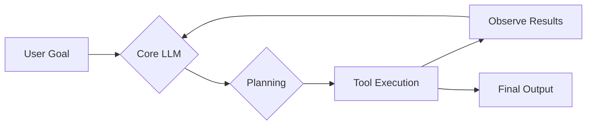
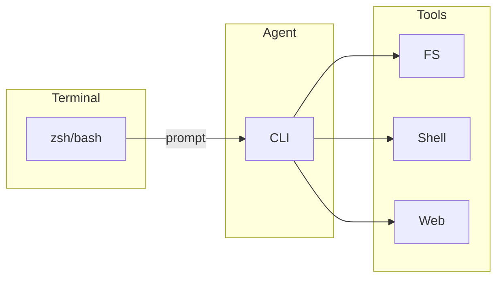
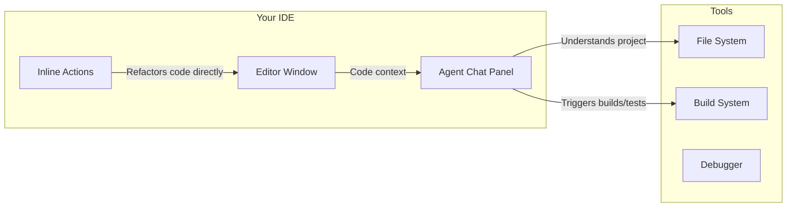
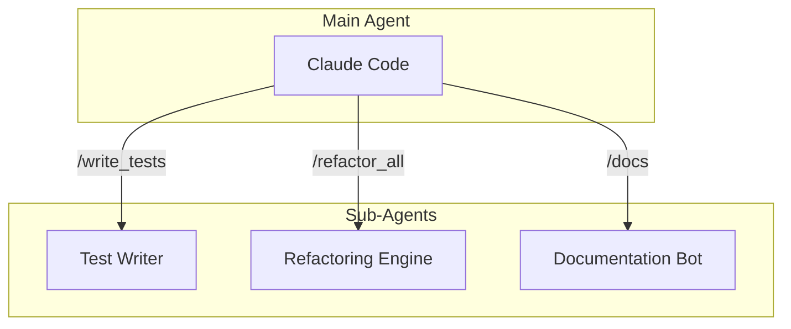
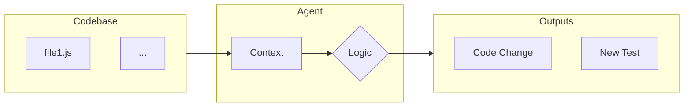
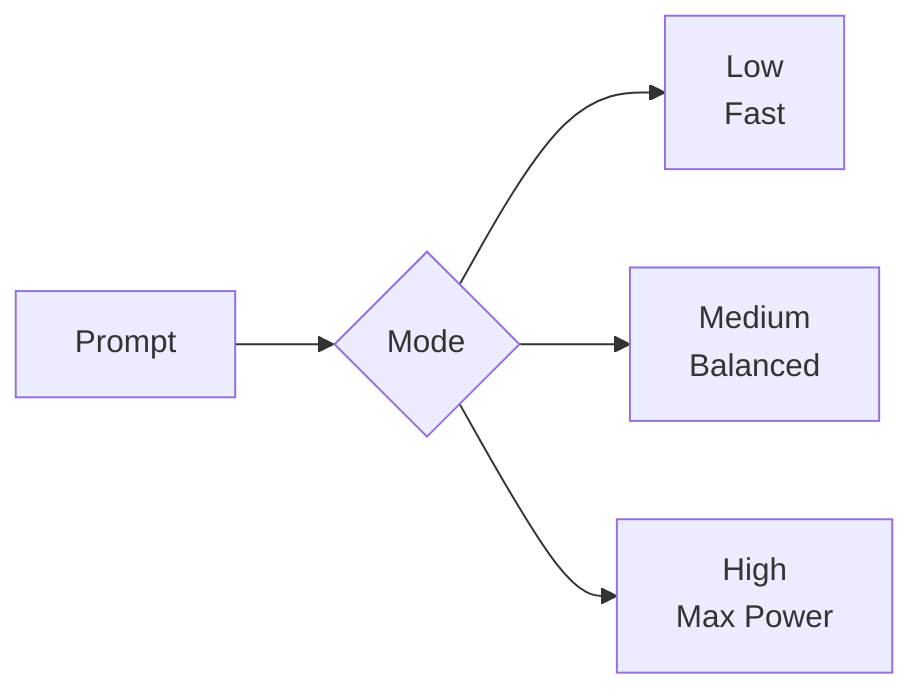

# The Developer's AI Co‑pilot: A Comparative Analysis

A look at the current landscape of AI Agent tools for software developers.

<style>
/* Compact utilities to keep dense slides within viewport */
.compact { font-size: 0.95rem; }
.compact h1 { font-size: 2.2rem; margin-bottom: 0.6rem; }
.compact h2 { font-size: 1.25rem; margin: 0.5rem 0; }
.compact pre { font-size: 0.8rem; line-height: 1.25; white-space: pre-wrap; word-break: break-word; }
.compact code { font-size: 0.95em; }
.compact .grid { gap: 1rem; }
.compact ul { margin: 0.25rem 0 0.5rem; }
</style>

---

## What is an AI Agent?

An AI Agent is more than a chatbot. It’s a system that can:
1.  Understand a high-level goal.
2.  Create a step-by-step plan.
3.  Execute the plan using tools.
4.  Observe the results and self-correct.

---

## A Typical Agent Workflow



---

## Key Capabilities for Comparison

When evaluating AI agents, we consider several factors:

- **Core Model:** The underlying Large Language Model (e.g., Gemini, GPT-4, Claude 3).
- **Context Window:** How much information the agent can hold at once.
- **Tool Integration:** The ability to use external tools like the shell, file system, or web search.
- **User Interface:** Is it a Command-Line Interface (CLI) or integrated into an IDE?
- **Extensibility:** Can you add custom commands, sub-agents, or other configurations?
- **Security:** Features like sandboxing and command previews (MCP servers).

---

## The CLI Agents

- **Gemini CLI**
- **OpenAI Codex CLI**
- **Claude Code**

These agents operate from the command line, integrating with your shell workflow.



---

## The IDE-Native Agents

These agents live directly inside your code editor, offering a more integrated experience.

- **JetBrains Junie**
- **Cursor**



---

## Feature Matrix (1/2)

| Feature | Gemini CLI | OpenAI Codex CLI | Claude Code | JetBrains Junie | Cursor |
|---|---|---|---|---|---|
| **Core Model** | Gemini (1.5/Pro family) | GPT‑5 (Low/Medium/High modes) | Claude 3 family | Uses configured providers (IDE context) | OpenAI + Anthropic |
| **UI** | CLI | CLI | CLI | IDE Integrated | IDE (AI‑first) |
| **Tooling** | MCP + shell/FS | Shell/FS + MCP (varies) | MCP + shell/FS | IDE actions, builds, VCS | Local FS + provider APIs |

---
class: compact
---

## Feature Matrix (2/2)

| Feature | Gemini CLI | OpenAI Codex CLI | Claude Code | JetBrains Junie | Cursor |
|---|---|---|---|---|---|
| **Extensibility**| Standard | Standard | High (sub‑agents) | High (IDE plugins) | Moderate |
| **Tool Protocols & Sandboxing** | MCP; sandbox/approvals | MCP (where supported); approvals | MCP; approvals | IDE sandbox | Local‑first options |
| **Context** | Large / growing | Large / growing | Very large | IDE‑indexed | Large |

---

## Deep Dive: Claude Code

Claude Code stands out with its powerful extensibility features.

- **/custom_commands:** Users can define their own slash commands to automate repetitive workflows.
- **Sub-agents:** The ability to delegate complex tasks to specialized, subordinate agents.



---

## Deep Dive: Gemini CLI

Gemini's key advantage is its **massive context window**. This allows the agent to load an entire codebase into memory, enabling repository-wide understanding and changes.



---
class: compact
---

## Deep Dive: OpenAI Codex CLI

Codex CLI now runs GPT‑5 with three modes so you can trade latency for capability depending on the task.



---
class: compact
---

### OpenAI Codex Modes: Notes

- Low: fastest; Medium: balanced; High: maximum capability
- Configure via CLI flags or environment variables

---
class: compact
---

## MCP Configuration (CLI)

CLI example (generic)

```json
{
  "mcpServers": {
    "context7": {
      "transport": "sse",
      "url": "https://example.com/mcp",
      "headers": { "Authorization": "Bearer <token>" }
    },
    "playwright": {
      "transport": "stdio",
      "command": "npx",
      "args": ["-y", "@playwright/mcp@latest"]
    }
  }
}
```

---
class: compact
---

## MCP Configuration (IDE)

```json
{
  "mcpServers": {
    "context7": { "transport": "sse", "url": "https://…", "headers": { "Authorization": "Bearer …" } }
  }
}
```

Tip: Use env vars for secrets when supported; otherwise rotate keys frequently.

---

## Terminology Note

- “Codex” historically referred to an OpenAI code model family. “Codex CLI” in this talk refers to an open‑source agentic CLI interface, not the legacy model.
- “Security” in matrices is reframed as “Tool Protocols & Sandboxing” to reflect MCP support and approval modes.

---

## Scope & Currency

- Details reflect the state of tools as of Sep 2025.
- Names and capabilities evolve quickly; verify against the latest docs for your toolchain.

---


## The Future is Autonomous

All these tools are moving towards a common set of goals:

- **Massive Context Windows:** Ingesting entire codebases for complete understanding.
- **Increased Autonomy:** Moving from co-pilot to autonomous agent that can handle entire features from a single prompt.
- **Multi-modality:** Understanding not just code, but also diagrams, mockups, and audio/video feedback.
- **Self-Healing Code:** Agents that can detect, diagnose, and fix bugs on their own.

---

## Conclusion

- **CLI Agents (Gemini, OpenAI, Claude):** Best for developers who live in the terminal and want a powerful, scriptable assistant.
- **IDE Agents (Junie, Cursor):** Best for developers who want a deeply integrated, visual co-pilot within their existing workflow.

The right tool depends on your personal workflow and the specific tasks you need to accomplish. The field is evolving rapidly, so expect capabilities to expand across the board.
