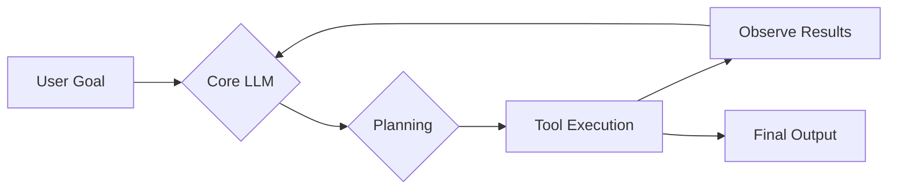
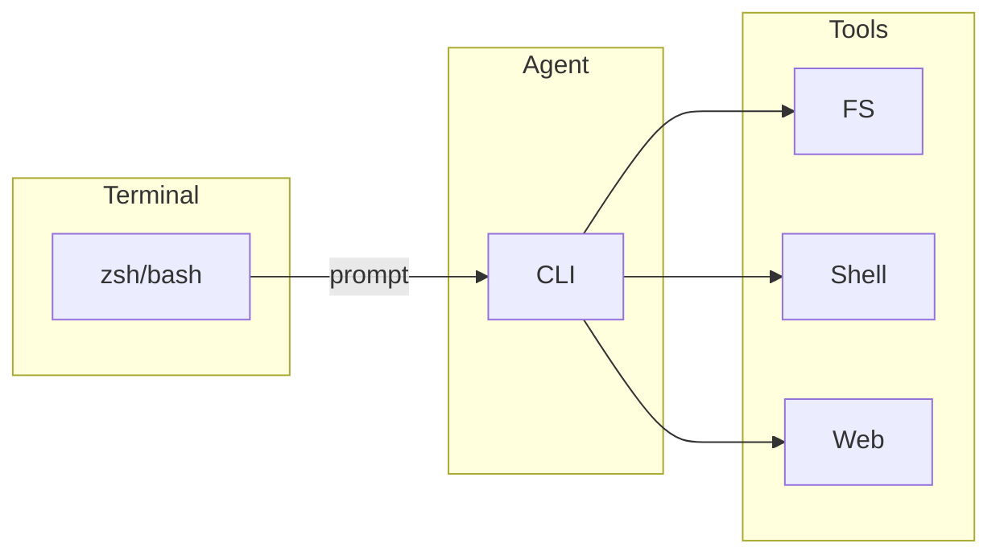
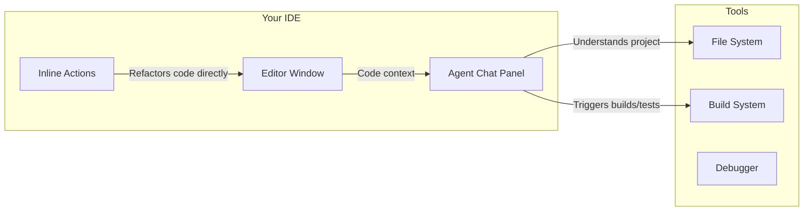
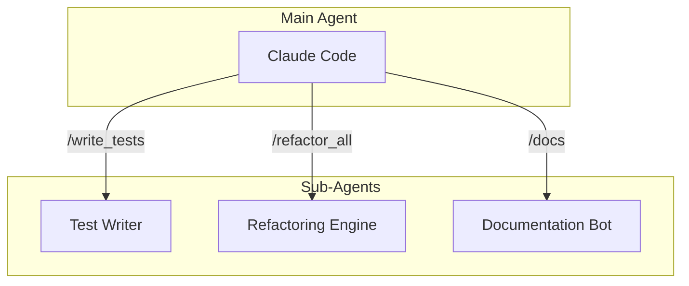
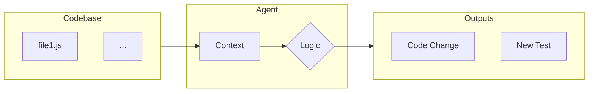
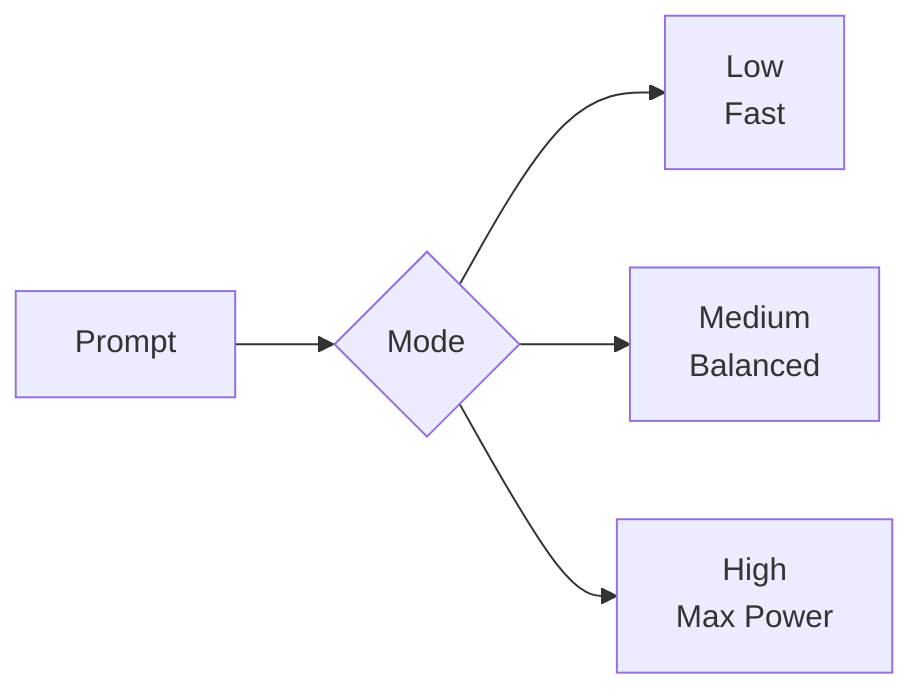

# The Developer's AI Co‑pilot: A Comparative Analysis

A look at the current landscape of AI Agent tools for software developers.

 

---

## What is an AI Agent?

An AI Agent is more than a chatbot. It’s a system that can:
1.  Understand a high-level goal.
2.  Create a step-by-step plan.
3.  Execute the plan using tools.
4.  Observe the results and self-correct.

---

## A Typical Agent Workflow



---

## Key Capabilities for Comparison

When evaluating AI agents, we consider several factors:

- **Core Model:** The underlying Large Language Model (e.g., Gemini, GPT-4, Claude 3).
- **Context Window:** How much information the agent can hold at once.
- **Tool Integration:** The ability to use external tools like the shell, file system, or web search.
- **User Interface:** Is it a Command-Line Interface (CLI) or integrated into an IDE?
- **Extensibility:** Can you add custom commands, sub-agents, or other configurations?
- **Security:** Features like sandboxing and command previews (MCP servers).

---
class: cli-pad
---

## The CLI Agents

- **Gemini CLI**
- **OpenAI Codex CLI**
- **Claude Code**

<div style="padding-bottom: 2.5rem">



</div>

---

## The IDE-Native Agents

These agents live directly inside your code editor, offering a more integrated experience.

- **JetBrains Junie**
- **Cursor**



---

## Feature Matrix

<style>
#fm-wrap { overflow-x: auto; -webkit-overflow-scrolling: touch; margin: 0.5rem 0 0.75rem; }
#fm-wrap table {
  width: 100%;
  min-width: 980px;
  border-collapse: separate;
  border-spacing: 0;
  border-radius: 12px;
  overflow: hidden;
  box-shadow: 0 2px 10px rgba(0,0,0,0.06);
  border: 1px solid rgba(127,127,127,0.18);
}
#fm-wrap thead th {
  position: sticky; top: 0; z-index: 2;
  text-align: center; font-weight: 700; font-size: 1.0em; letter-spacing: 0.01em;
  background: rgba(127,127,127,0.10);
  border-bottom: 2px solid rgba(127,127,127,0.25);
  backdrop-filter: saturate(120%) blur(2px);
}
#fm-wrap th, #fm-wrap td { padding: 0.6rem 0.8rem; border-bottom: 1px solid rgba(127,127,127,0.15); vertical-align: top; }
#fm-wrap tbody tr:nth-child(even) td { background: rgba(127,127,127,0.06); }
#fm-wrap tbody tr:last-child td { border-bottom: none; }
#fm-wrap th:first-child, #fm-wrap td:first-child {
  position: sticky; left: 0; z-index: 1;
  background: rgba(127,127,127,0.08);
  border-right: 1px solid rgba(127,127,127,0.15);
}
#fm-wrap thead th:first-child { z-index: 3; }
.dark #fm-wrap thead th { background: rgba(255,255,255,0.06); }
.dark #fm-wrap th, .dark #fm-wrap td { border-bottom-color: rgba(255,255,255,0.12); }
.dark #fm-wrap tbody tr:nth-child(even) td { background: rgba(255,255,255,0.04); }
.dark #fm-wrap th:first-child, .dark #fm-wrap td:first-child { background: rgba(255,255,255,0.06); border-right-color: rgba(255,255,255,0.10); }
.fm-badge { display: inline-block; padding: 0.18rem 0.5rem; border-radius: 9999px; background: rgba(99,102,241,0.14); font-size: 0.85em; line-height: 1.2; white-space: nowrap; }
.fm-badge.ui { background: rgba(34,197,94,0.18); }
.fm-badge.mcp { background: rgba(59,130,246,0.18); }

/* ——— Enhancements: sizing, separators, spacing ——— */
/* Wider first column for readability */
#fm-wrap th:first-child, #fm-wrap td:first-child { min-width: 12rem; max-width: 14rem; }
/* Allow header wrapping and balance line height */
#fm-wrap th { white-space: normal; line-height: 1.2; }
#fm-wrap td { vertical-align: middle; }
/* Subtle vertical separators between columns */
#fm-wrap th + th, #fm-wrap td + td { border-left: 1px solid rgba(127,127,127,0.10); }
/* Slightly tighter cell padding */
#fm-wrap th, #fm-wrap td { padding: 0.5rem 0.7rem; }
/* Badge margins and weight for better wrapping */
#fm-wrap td > .fm-badge { margin: 0 0.35rem 0.35rem 0; font-weight: 500; }
</style>

<div id="fm-wrap">
<table>
  <thead>
    <tr>
      <th>Feature</th>
      <th>Gemini CLI</th>
      <th>OpenAI Codex CLI</th>
      <th>Claude Code</th>
      <th>JetBrains Junie</th>
      <th>Cursor</th>
    </tr>
  </thead>
  <tbody>
    <tr>
      <td><strong>Core Model</strong></td>
      <td><span class="badge">Gemini 1.5 / Pro</span></td>
      <td><span class="badge">GPT‑5 (Low/Med/High)</span></td>
      <td><span class="badge">Claude 3 family</span></td>
      <td><span class="badge">IDE‑configured providers</span></td>
      <td><span class="badge">OpenAI + Anthropic</span></td>
    </tr>
    <tr>
      <td><strong>UI</strong></td>
      <td><span class="fm-badge ui" title="Command-line Interface">🖥️ CLI</span></td>
      <td><span class="fm-badge ui" title="Command-line Interface">🖥️ CLI</span></td>
      <td><span class="fm-badge ui" title="Command-line Interface">🖥️ CLI</span></td>
      <td><span class="fm-badge ui" title="Integrated Development Environment">🧩 IDE</span></td>
      <td><span class="fm-badge ui" title="Integrated Development Environment">🧩 IDE</span></td>
    </tr>
    <tr>
      <td><strong>Tooling</strong></td>
      <td>
        <span class="fm-badge mcp" title="Model Context Protocol">🔌 MCP</span>
        <span class="fm-badge" title="Shell access">Shell</span>
        <span class="fm-badge" title="File system access">FS</span>
      </td>
      <td>
        <span class="fm-badge" title="Shell access">Shell</span>
        <span class="fm-badge" title="File system access">FS</span>
        <span class="fm-badge mcp" title="Model Context Protocol">🔌 MCP</span>
      </td>
      <td>
        <span class="fm-badge mcp" title="Model Context Protocol">🔌 MCP</span>
        <span class="fm-badge" title="Shell access">Shell</span>
        <span class="fm-badge" title="File system access">FS</span>
      </td>
      <td>
        <span class="fm-badge" title="IDE actions">IDE actions</span>
        <span class="fm-badge" title="Build integration">Builds</span>
        <span class="fm-badge" title="Version control">VCS</span>
      </td>
      <td>
        <span class="fm-badge" title="Local file system">Local FS</span>
        <span class="fm-badge" title="Provider APIs">Provider APIs</span>
      </td>
    </tr>
    <tr>
      <td><strong>Extensibility</strong></td>
      <td><span class="fm-badge" title="Extensibility level">Standard</span></td>
      <td><span class="fm-badge" title="Extensibility level">Standard</span></td>
      <td><span class="fm-badge" title="Extensibility level">High (sub‑agents)</span></td>
      <td><span class="fm-badge" title="Extensibility level">High (IDE plugins)</span></td>
      <td><span class="fm-badge" title="Extensibility level">Moderate</span></td>
    </tr>
    <tr>
      <td><strong>Tool Protocols &amp; Sandboxing</strong></td>
      <td><span class="fm-badge mcp" title="Model Context Protocol">🔌 MCP</span> <span class="fm-badge" title="Sandboxing and approval flows">Sandbox/Approvals</span></td>
      <td><span class="fm-badge mcp" title="Model Context Protocol">🔌 MCP</span> <span class="fm-badge" title="Approval flows">Approvals</span></td>
      <td><span class="fm-badge mcp" title="Model Context Protocol">🔌 MCP</span> <span class="fm-badge" title="Approval flows">Approvals</span></td>
      <td><span class="badge">IDE sandbox</span></td>
      <td><span class="badge">Local‑first options</span></td>
    </tr>
    <tr>
      <td><strong>Context</strong></td>
      <td><span class="fm-badge" title="Context window size">Large / growing</span></td>
      <td><span class="fm-badge" title="Context window size">Large / growing</span></td>
      <td><span class="fm-badge" title="Context window size">Very large</span></td>
      <td><span class="fm-badge" title="Context source">IDE‑indexed</span></td>
      <td><span class="fm-badge" title="Context window size">Large</span></td>
    </tr>
  </tbody>
  </table>
</div>

 

---

## Deep Dive: Claude Code

Claude Code stands out with its powerful extensibility features.

- **/custom_commands:** Users can define their own slash commands to automate repetitive workflows.
- **Sub-agents:** The ability to delegate complex tasks to specialized, subordinate agents.



---

## Deep Dive: Gemini CLI

Gemini's key advantage is its **massive context window**. This allows the agent to load an entire codebase into memory, enabling repository-wide understanding and changes.



---
class: compact
---

## Deep Dive: OpenAI Codex CLI

Codex CLI now runs GPT‑5 with three modes so you can trade latency for capability depending on the task.



---
class: compact
---

### OpenAI Codex Modes: Notes

- Low: fastest; Medium: balanced; High: maximum capability
- Configure via CLI flags or environment variables

---
class: compact
---

## MCP Configuration (CLI)

CLI example (generic)

```json
{
  "mcpServers": {
    "context7": {
      "transport": "sse",
      "url": "https://example.com/mcp",
      "headers": { "Authorization": "Bearer <token>" }
    },
    "playwright": {
      "transport": "stdio",
      "command": "npx",
      "args": ["-y", "@playwright/mcp@latest"]
    }
  }
}
```

---
class: compact
---

## MCP Configuration (IDE)

```json
{
  "mcpServers": {
    "context7": { "transport": "sse", "url": "https://…", "headers": { "Authorization": "Bearer …" } }
  }
}
```

Tip: Use env vars for secrets when supported; otherwise rotate keys frequently.

---

## Terminology Note

- “Codex” historically referred to an OpenAI code model family. “Codex CLI” in this talk refers to an open‑source agentic CLI interface, not the legacy model.
- “Security” in matrices is reframed as “Tool Protocols & Sandboxing” to reflect MCP support and approval modes.

---

## Scope & Currency

- Details reflect the state of tools as of Sep 2025.
- Names and capabilities evolve quickly; verify against the latest docs for your toolchain.

---


## The Future is Autonomous

All these tools are moving towards a common set of goals:

- **Massive Context Windows:** Ingesting entire codebases for complete understanding.
- **Increased Autonomy:** Moving from co-pilot to autonomous agent that can handle entire features from a single prompt.
- **Multi-modality:** Understanding not just code, but also diagrams, mockups, and audio/video feedback.
- **Self-Healing Code:** Agents that can detect, diagnose, and fix bugs on their own.

---

## Conclusion

- **CLI Agents (Gemini, OpenAI, Claude):** Best for developers who live in the terminal and want a powerful, scriptable assistant.
- **IDE Agents (Junie, Cursor):** Best for developers who want a deeply integrated, visual co-pilot within their existing workflow.

The right tool depends on your personal workflow and the specific tasks you need to accomplish. The field is evolving rapidly, so expect capabilities to expand across the board.
