# The Developer's AI Co‑pilot: A Comparative Analysis

<div style="color: #fbbf24; font-size: 1.2em; margin-top: 1em;">
A look at the current landscape of AI Agent tools for software developers.
</div>

 

---
layout: default
background: 'linear-gradient(to bottom right, #1e293b, #334155)'
---

## <span style="color: #60a5fa;">What is an AI Agent?</span>

<div style="font-size: 1.1em; line-height: 1.8;">

An AI Agent is more than a chatbot. It's a system that can:

<div style="background: linear-gradient(135deg, #667eea 0%, #764ba2 100%); padding: 0.1em 0.5em; border-radius: 8px; margin: 0.5em 0;">
1. 🎯 Understand a high-level goal.
</div>

<div style="background: linear-gradient(135deg, #f093fb 0%, #f5576c 100%); padding: 0.1em 0.5em; border-radius: 8px; margin: 0.5em 0;">
2. 📋 Create a step-by-step plan.
</div>

<div style="background: linear-gradient(135deg, #4facfe 0%, #00f2fe 100%); padding: 0.1em 0.5em; border-radius: 8px; margin: 0.5em 0;">
3. ⚙️ Execute the plan using tools.
</div>

<div style="background: linear-gradient(135deg, #43e97b 0%, #38f9d7 100%); padding: 0.1em 0.5em; border-radius: 8px; margin: 0.5em 0;">
4. 🔄 Observe the results and self-correct.
</div>

</div>

---
background: 'linear-gradient(to bottom right, #0f172a, #1e293b)'
---

## <span style="color: #a78bfa;">A Typical Agent Workflow</span>


---
background: 'linear-gradient(135deg, #1a365d 0%, #2c5282 100%)'
---

## <span style="color: #fbbf24;">Key Capabilities for Comparison</span>

<div style="font-size: 1.05em;">

When evaluating AI agents, we consider several factors:

- **<span style="color: #60a5fa;">Core Model:</span>** The underlying Large Language Model (e.g., Gemini, GPT-4, Claude).
- **<span style="color: #a78bfa;">Context Window:</span>** How much information the agent can hold at once.
- **<span style="color: #34d399;">Tool Integration:</span>** The ability to use external tools like shell, file system, or web search.
- **<span style="color: #f472b6;">User Interface:</span>** Is it a Command-Line Interface (CLI) or integrated into an IDE?
- **<span style="color: #fbbf24;">Extensibility:</span>** Can you add custom commands, sub-agents, or other configurations?
- **<span style="color: #fb923c;">Security:</span>** Features like sandboxing and command previews (MCP servers).

</div>

---
class: cli-pad
background: 'linear-gradient(to bottom, #312e81, #1e1b4b)'
---

## <span style="color: #818cf8;">The CLI Agents</span>

<div style="font-size: 1.2em; line-height: 2;">

- **<span style="color: #60a5fa;">Gemini CLI</span>**
- **<span style="color: #34d399;">OpenAI Codex CLI</span>**
- **<span style="color: #f472b6;">Claude Code</span>**

</div>

<div style="padding-bottom: 2.5rem">


</div>

---
background: 'linear-gradient(135deg, #065f46, #047857)'
---

## <span style="color: #86efac;">The IDE-Native Agents</span>

<div style="color: #d1fae5; font-size: 1.1em;">
These agents live directly inside your code editor, offering a more integrated experience.
</div>

<div style="font-size: 1.3em; line-height: 2.5; margin-top: 1em;">

- **<span style="color: #fbbf24;">JetBrains Junie</span>**
- **<span style="color: #60a5fa;">Cursor</span>**

</div>


---
background: 'linear-gradient(to bottom, #0f172a, #1e293b)'
---

## <span style="color: #fbbf24;">Feature Matrix</span>

<style>
#fm-wrap { overflow-x: auto; -webkit-overflow-scrolling: touch; margin: 0.5rem 0 0.75rem; }
#fm-wrap table {
  width: 100%;
  min-width: 980px;
  border-collapse: separate;
  border-spacing: 0;
  border-radius: 12px;
  overflow: hidden;
  box-shadow: 0 4px 20px rgba(0,0,0,0.5);
  border: 2px solid rgba(99,102,241,0.3);
  background: rgba(15, 23, 42, 0.95);
}
#fm-wrap thead th {
  position: sticky; top: 0; z-index: 2;
  text-align: center; font-weight: 700; font-size: 1.0em; letter-spacing: 0.01em;
  background: linear-gradient(135deg, rgba(99,102,241,0.2) 0%, rgba(168,85,247,0.2) 100%);
  border-bottom: 2px solid rgba(99,102,241,0.4);
  backdrop-filter: saturate(120%) blur(2px);
  color: #fbbf24;
  text-shadow: 0 1px 2px rgba(0,0,0,0.3);
}
#fm-wrap th, #fm-wrap td { 
  padding: 0.6rem 0.8rem; 
  border-bottom: 1px solid rgba(99,102,241,0.15); 
  vertical-align: top;
  color: #e2e8f0;
}
#fm-wrap tbody tr:nth-child(even) td { 
  background: rgba(99,102,241,0.05); 
}
#fm-wrap tbody tr:hover td {
  background: rgba(168,85,247,0.1) !important;
  transition: background 0.2s;
}
#fm-wrap tbody tr:last-child td { border-bottom: none; }
#fm-wrap th:first-child, #fm-wrap td:first-child {
  position: sticky; left: 0; z-index: 1;
  background: linear-gradient(90deg, rgba(99,102,241,0.15) 0%, rgba(99,102,241,0.08) 100%);
  border-right: 2px solid rgba(99,102,241,0.25);
  font-weight: 600;
  color: #a78bfa;
}
#fm-wrap thead th:first-child { 
  z-index: 3; 
  background: linear-gradient(135deg, rgba(99,102,241,0.3) 0%, rgba(168,85,247,0.3) 100%);
}
#fm-wrap td strong {
  color: #c4b5fd;
}
.fm-badge, .badge { 
  display: inline-block; 
  padding: 0.25rem 0.6rem; 
  border-radius: 9999px; 
  font-size: 0.85em; 
  line-height: 1.2; 
  white-space: nowrap;
  font-weight: 500;
  background: linear-gradient(135deg, rgba(99,102,241,0.2) 0%, rgba(168,85,247,0.2) 100%);
  border: 1px solid rgba(168,85,247,0.3);
  color: #e9d5ff;
}
.fm-badge.ui { 
  background: linear-gradient(135deg, rgba(34,197,94,0.2) 0%, rgba(16,185,129,0.2) 100%);
  border: 1px solid rgba(34,197,94,0.3);
  color: #86efac;
}
.fm-badge.mcp { 
  background: linear-gradient(135deg, rgba(59,130,246,0.2) 0%, rgba(37,99,235,0.2) 100%);
  border: 1px solid rgba(59,130,246,0.3);
  color: #93c5fd;
}
.fm-badge[title*="Shell"], .fm-badge[title*="FS"] {
  background: linear-gradient(135deg, rgba(251,146,60,0.2) 0%, rgba(249,115,22,0.2) 100%);
  border: 1px solid rgba(251,146,60,0.3);
  color: #fed7aa;
}
.fm-badge[title*="IDE"] {
  background: linear-gradient(135deg, rgba(236,72,153,0.2) 0%, rgba(219,39,119,0.2) 100%);
  border: 1px solid rgba(236,72,153,0.3);
  color: #fbcfe8;
}

/* ——— Enhancements: sizing, separators, spacing ——— */
/* Wider first column for readability */
#fm-wrap th:first-child, #fm-wrap td:first-child { min-width: 12rem; max-width: 14rem; }
/* Allow header wrapping and balance line height */
#fm-wrap th { white-space: normal; line-height: 1.2; }
#fm-wrap td { vertical-align: middle; }
/* Subtle vertical separators between columns */
#fm-wrap th + th, #fm-wrap td + td { 
  border-left: 1px solid rgba(99,102,241,0.15); 
}
/* Slightly tighter cell padding */
#fm-wrap th, #fm-wrap td { padding: 0.5rem 0.7rem; }
/* Badge margins and weight for better wrapping */
#fm-wrap td > .fm-badge, #fm-wrap td > .badge { margin: 0 0.35rem 0.35rem 0; }
</style>

<div id="fm-wrap">
<table>
  <thead>
    <tr>
      <th>Feature</th>
      <th>Gemini CLI</th>
      <th>OpenAI Codex CLI</th>
      <th>Claude Code</th>
      <th>JetBrains Junie</th>
      <th>Cursor</th>
    </tr>
  </thead>
  <tbody>
    <tr>
      <td><strong>Core Model</strong></td>
      <td><span class="badge">Gemini 2.5-Pro / 2.5-Flash</span></td>
      <td><span class="badge">GPT‑5 (Low/Med/High)</span></td>
      <td><span class="badge">Claude Opus 4.1 / Sonnet 4</span></td>
      <td><span class="badge">IDE‑configured providers</span></td>
      <td><span class="badge">OpenAI + Anthropic</span></td>
    </tr>
    <tr>
      <td><strong>UI</strong></td>
      <td><span class="fm-badge ui" title="Command-line Interface">🖥️ CLI</span></td>
      <td><span class="fm-badge ui" title="Command-line Interface">🖥️ CLI</span></td>
      <td><span class="fm-badge ui" title="Command-line Interface">🖥️ CLI</span></td>
      <td><span class="fm-badge ui" title="Integrated Development Environment">🧩 IDE</span></td>
      <td><span class="fm-badge ui" title="Integrated Development Environment">🧩 IDE</span></td>
    </tr>
    <tr>
      <td><strong>Tooling</strong></td>
      <td>
        <span class="fm-badge mcp" title="Model Context Protocol">🔌 MCP</span>
        <span class="fm-badge" title="Shell access">Shell</span>
        <span class="fm-badge" title="File system access">FS</span>
      </td>
      <td>
        <span class="fm-badge" title="Shell access">Shell</span>
        <span class="fm-badge" title="File system access">FS</span>
        <span class="fm-badge mcp" title="Model Context Protocol">🔌 MCP</span>
      </td>
      <td>
        <span class="fm-badge mcp" title="Model Context Protocol">🔌 MCP</span>
        <span class="fm-badge" title="Shell access">Shell</span>
        <span class="fm-badge" title="File system access">FS</span>
      </td>
      <td>
        <span class="fm-badge" title="IDE actions">IDE actions</span>
        <span class="fm-badge" title="Build integration">Builds</span>
        <span class="fm-badge" title="Version control">VCS</span>
      </td>
      <td>
        <span class="fm-badge" title="Local file system">Local FS</span>
        <span class="fm-badge" title="Provider APIs">Provider APIs</span>
      </td>
    </tr>
    <tr>
      <td><strong>Extensibility</strong></td>
      <td><span class="fm-badge" title="Extensibility level">Standard</span></td>
      <td><span class="fm-badge" title="Extensibility level">Standard</span></td>
      <td><span class="fm-badge" title="Extensibility level">High (sub‑agents)</span></td>
      <td><span class="fm-badge" title="Extensibility level">High (IDE plugins)</span></td>
      <td><span class="fm-badge" title="Extensibility level">Moderate</span></td>
    </tr>
    <tr>
      <td><strong>Tool Protocols &amp; Sandboxing</strong></td>
      <td><span class="fm-badge mcp" title="Model Context Protocol">🔌 MCP</span> <span class="fm-badge" title="Sandboxing and approval flows">Sandbox/Approvals</span></td>
      <td><span class="fm-badge mcp" title="Model Context Protocol">🔌 MCP</span> <span class="fm-badge" title="Approval flows">Approvals</span></td>
      <td><span class="fm-badge mcp" title="Model Context Protocol">🔌 MCP</span> <span class="fm-badge" title="Approval flows">Approvals</span></td>
      <td><span class="badge">IDE sandbox</span></td>
      <td><span class="badge">Local‑first options</span></td>
    </tr>
    <tr>
      <td><strong>Context</strong></td>
      <td><span class="fm-badge" title="Context window size">Large / growing</span></td>
      <td><span class="fm-badge" title="Context window size">Large / growing</span></td>
      <td><span class="fm-badge" title="Context window size">Very large</span></td>
      <td><span class="fm-badge" title="Context source">IDE‑indexed</span></td>
      <td><span class="fm-badge" title="Context window size">Large</span></td>
    </tr>
  </tbody>
  </table>
</div>

 

---
background: 'linear-gradient(135deg, #7c3aed, #a855f7)'
---

## <span style="color: #fbbf24;">Deep Dive: Claude Code</span>

<div style="color: #e9d5ff; font-size: 1.1em;">
Claude Code stands out with its powerful extensibility features.
</div>

<div style="margin-top: 1em;">

- **<span style="color: #c4b5fd;">/custom_commands:</span>** Users can define their own slash commands to automate repetitive workflows.
- **<span style="color: #ddd6fe;">Sub-agents:</span>** The ability to delegate complex tasks to specialized, subordinate agents.

</div>


---
background: 'linear-gradient(to bottom right, #1e40af, #3b82f6)'
---

## <span style="color: #93c5fd;">Deep Dive: Gemini CLI</span>

<div style="color: #dbeafe; font-size: 1.1em;">
Gemini's key advantage is its <span style="color: #fbbf24; font-weight: bold;">massive context window</span>. This allows the agent to load an entire codebase into memory, enabling repository-wide understanding and changes.
</div>


---
class: compact
background: 'linear-gradient(135deg, #065f46, #064e3b)'
---

## <span style="color: #86efac;">Deep Dive: OpenAI Codex CLI</span>

<div style="color: #d1fae5; font-size: 1.1em;">
Codex CLI now runs <span style="color: #fbbf24; font-weight: bold;">GPT-5 with three modes</span> so you can trade latency for capability depending on the task.
</div>


<div style="margin-top: 1em; background: rgba(52, 211, 153, 0.1); padding: 0.8em; border-radius: 8px;">

**Mode Configuration:**
- **Low:** Fastest response, basic tasks
- **Medium:** Balanced performance
- **High:** Maximum capability for complex work

</div>

---
class: compact
background: 'linear-gradient(135deg, #312e81, #1e1b4b)'
---

## <span style="color: #fbbf24;">MCP Configuration: Each Tool is Different</span>

<div style="display: grid; grid-template-columns: 1fr 1fr; gap: 1rem; font-size: 0.85em;">

<div style="background: rgba(99,102,241,0.1); padding: 0.8rem; border-radius: 8px; border: 1px solid rgba(99,102,241,0.3);">

### <span style="color: #f472b6;">OpenAI Codex (TOML)</span>
```toml
# codex-mcp.toml - stdio only!
[mcp_servers.playwright]
command = "npx"
args = ["@playwright/mcp@latest"]

[mcp_servers.context7]
command = "npx"
args = ["-y", "@upstash/context7-mcp", 
        "--api-key", "ctx7sk-..."]
```
</div>

<div style="background: rgba(59,130,246,0.1); padding: 0.8rem; border-radius: 8px; border: 1px solid rgba(59,130,246,0.3);">

### <span style="color: #60a5fa;">Gemini (JSON)</span>
```json
// gemini-config.json
{
  "playwright": {
    "command": "npx",
    "args": ["@playwright/mcp@latest"]
  },
  "context7": {
    "httpUrl": "https://mcp.context7.com/mcp",
    "headers": {
      "CONTEXT7_API_KEY": "ctx7sk-..."
    }
  }
}
```
</div>

</div>

<div style="background: rgba(168,85,247,0.1); padding: 0.8rem; border-radius: 8px; border: 1px solid rgba(168,85,247,0.3); margin-top: 1rem;">

### <span style="color: #a78bfa;">Claude Code (CLI Command)</span>
```bash
# Add via CLI - supports multiple transports (stdio, http, sse)
claude mcp add --transport http context7 https://mcp.context7.com/mcp \
  --header "CONTEXT7_API_KEY: ctx7sk-..."
```
</div>

---

## Terminology Note

- “Codex” historically referred to an OpenAI code model family. “Codex CLI” in this talk refers to an open‑source agentic CLI interface, not the legacy model.
- “Security” in matrices is reframed as “Tool Protocols & Sandboxing” to reflect MCP support and approval modes.

---

## Scope & Currency

- Details reflect the state of tools as of Sep 2025.
- Names and capabilities evolve quickly; verify against the latest docs for your toolchain.

---
background: 'linear-gradient(135deg, #0891b2, #06b6d4)'
---

## <span style="color: #fde047;">The Future is Autonomous</span>

<div style="font-size: 1.1em;">

All these tools are moving towards a common set of goals:

<div style="background: rgba(254, 240, 138, 0.1); border-left: 4px solid #fbbf24; padding: 0.5em; margin: 0.5em 0;">
<strong style="color: #fbbf24;">🚀 Massive Context Windows:</strong> <span style="color: #e0f2fe;">Ingesting entire codebases for complete understanding.</span>
</div>

<div style="background: rgba(167, 139, 250, 0.1); border-left: 4px solid #a78bfa; padding: 0.5em; margin: 0.5em 0;">
<strong style="color: #a78bfa;">🤖 Increased Autonomy:</strong> <span style="color: #e0f2fe;">Moving from co-pilot to autonomous agent that can handle entire features from a single prompt.</span>
</div>

<div style="background: rgba(52, 211, 153, 0.1); border-left: 4px solid #34d399; padding: 0.5em; margin: 0.5em 0;">
<strong style="color: #34d399;">🎨 Multi-modality:</strong> <span style="color: #e0f2fe;">Understanding not just code, but also diagrams, mockups, and audio/video feedback.</span>
</div>

<div style="background: rgba(251, 146, 60, 0.1); border-left: 4px solid #fb923c; padding: 0.5em; margin: 0.5em 0;">
<strong style="color: #fb923c;">🔧 Self-Healing Code:</strong> <span style="color: #e0f2fe;">Agents that can detect, diagnose, and fix bugs on their own.</span>
</div>

</div>

---
background: 'linear-gradient(135deg, #dc2626, #991b1b)'
---

## <span style="color: #fbbf24;">From Theory to Practice</span>

<div style="font-size: 1.1em;">

<div style="background: rgba(254, 240, 138, 0.1); border: 2px solid #fbbf24; padding: 1.5em; border-radius: 12px; margin: 1em 0;">

### <span style="color: #fde047;">The Cosmic Catalog Project</span>

<span style="color: #e0f2fe;">A Spring Boot application that manages telescope observations from Hubble and JWST.</span>

<div style="margin-top: 1em; color: #cbd5e1;">

**Current State:**
- ✅ Feature-complete but unreviewed
- ✅ Java 21 with modern features
- ⚠️ Needs production hardening
- ⚠️ Missing comprehensive tests
- ⚠️ Could use refactoring

</div>

<div style="margin-top: 1.5em; padding: 1em; background: rgba(168, 85, 247, 0.15); border-radius: 8px;">
<strong style="color: #c4b5fd;">Perfect scenario for AI collaboration!</strong>
</div>

</div>

</div>

---
background: 'linear-gradient(135deg, #1e40af, #1e3a8a)'
---

## <span style="color: #fbbf24;">The Collaborative Process</span>

<div style="display: grid; grid-template-columns: 1fr 1fr; gap: 1.5rem; font-size: 0.95em;">

<div>

### <span style="color: #60a5fa;">Traditional Approach</span>

<div style="background: rgba(96, 165, 250, 0.1); padding: 1em; border-radius: 8px; margin-top: 0.5em;">

1. **Senior dev reviews** → Hours of meetings
2. **QA writes tests** → Days of work
3. **Tech writer documents** → More delays
4. **DevOps configures** → Additional setup

<div style="margin-top: 1em; color: #f87171;">
⏱️ **Time:** Weeks<br>
💰 **Cost:** High<br>
🔄 **Consistency:** Variable
</div>

</div>

</div>

<div>

### <span style="color: #34d399;">AI Agent Approach</span>

<div style="background: rgba(52, 211, 153, 0.1); padding: 1em; border-radius: 8px; margin-top: 0.5em;">

1. **Gemini reviews** → Instant analysis
2. **Claude refactors** → Immediate improvements
3. **Codex documents** → Auto-generated docs
4. **All agents test** → Comprehensive coverage

<div style="margin-top: 1em; color: #86efac;">
⏱️ **Time:** Minutes<br>
💰 **Cost:** Minimal<br>
🔄 **Consistency:** Reliable
</div>

</div>

</div>

</div>

---
background: 'linear-gradient(135deg, #7c3aed, #6d28d9)'
---

## <span style="color: #fbbf24;">Agent Collaboration Workflow</span>



<div style="margin-top: 1em; text-align: center; color: #e9d5ff;">

```mermaid
%%{init: {'theme':'dark', 'themeVariables': { 'primaryColor':'#a78bfa', 'primaryTextColor':'#fff', 'primaryBorderColor':'#c4b5fd', 'lineColor':'#e9d5ff', 'secondaryColor':'#60a5fa', 'tertiaryColor':'#34d399'}}}%%
graph TB
    subgraph "Shared Resources"
        A[GitHub Repository]
        B[AI_AGENT_TASKS.md]
        C[Git Tags/Branches]
    end
    
    subgraph "AI Agents"
        D[🔵 Gemini<br/>Code Review]
        E[🟣 Claude<br/>Refactoring]
        F[🟢 Codex<br/>Documentation]
    end
    
    subgraph "Outputs"
        G[Test Coverage]
        H[Clean Architecture]
        I[API Docs]
    end
    
    A --> D & E & F
    B --> D & E & F
    D --> G --> C
    E --> H --> C
    F --> I --> C
    C --> A
```

Each agent reads the shared task document, contributes their expertise, and tags their work for easy demonstration.
</div>

---
background: 'linear-gradient(135deg, #059669, #047857)'
---

## <span style="color: #fbbf24;">Key Innovation: Agent Autonomy</span>

<div style="font-size: 1.05em;">

<div style="background: rgba(254, 240, 138, 0.1); border: 2px solid #fbbf24; padding: 1.2em; border-radius: 10px;">

### <span style="color: #fde047;">Not Just Following Orders</span>

Instead of rigid instructions:
```markdown
❌ "Do exactly this: Extract HealthService from HealthController"
```

We give creative freedom:
```markdown
✅ "Improve the service layer architecture using your judgment"
```

</div>

<div style="margin-top: 1.5em; display: grid; grid-template-columns: 1fr 1fr 1fr; gap: 1rem;">

<div style="background: rgba(96, 165, 250, 0.15); padding: 0.8em; border-radius: 8px; text-align: center;">
<strong style="color: #60a5fa;">Gemini</strong><br>
<span style="color: #dbeafe; font-size: 0.9em;">Might find security issues we didn't expect</span>
</div>

<div style="background: rgba(168, 85, 247, 0.15); padding: 0.8em; border-radius: 8px; text-align: center;">
<strong style="color: #a78bfa;">Claude</strong><br>
<span style="color: #e9d5ff; font-size: 0.9em;">Could suggest architectural patterns</span>
</div>

<div style="background: rgba(52, 211, 153, 0.15); padding: 0.8em; border-radius: 8px; text-align: center;">
<strong style="color: #34d399;">Codex</strong><br>
<span style="color: #d1fae5; font-size: 0.9em;">May create interactive API playground</span>
</div>

</div>

</div>

---
background: 'linear-gradient(135deg, #0891b2, #0e7490)'
---

## <span style="color: #fbbf24;">Demo Structure - Part 1</span>

<div style="font-size: 1.05em;">

<div style="display: grid; grid-template-columns: auto 1fr; gap: 0.9rem; align-items: start;">

<div style="background: linear-gradient(135deg, #6366f1, #4f46e5); padding: 0.5em 0.9em; border-radius: 8px; font-weight: bold; color: #fde047;">v5</div>
<div style="background: rgba(99, 102, 241, 0.1); padding: 0.7em; border-radius: 8px;">
<strong style="color: #c4b5fd;">Starting Point</strong><br>
<span style="color: #e0f2fe; font-size: 0.9em;">Feature-complete Spring Boot app with modern Java 21</span>
</div>

<div style="background: linear-gradient(135deg, #8b5cf6, #7c3aed); padding: 0.5em 0.9em; border-radius: 8px; font-weight: bold; color: #fde047;">v6-v7</div>
<div style="background: rgba(139, 92, 246, 0.1); padding: 0.7em; border-radius: 8px;">
<strong style="color: #c4b5fd;">Gemini's Review & Testing</strong><br>
<span style="color: #e0f2fe; font-size: 0.9em;">Code review, version conflict tests, integration tests</span>
</div>

<div style="background: linear-gradient(135deg, #ec4899, #db2777); padding: 0.5em 0.9em; border-radius: 8px; font-weight: bold; color: #fde047;">v8</div>
<div style="background: rgba(236, 72, 153, 0.1); padding: 0.7em; border-radius: 8px;">
<strong style="color: #fbcfe8;">Claude's Initial Refactoring</strong><br>
<span style="color: #fce7f3; font-size: 0.9em;">Service extraction, ErrorResponse DTO, SOLID principles</span>
</div>

<div style="background: linear-gradient(135deg, #10b981, #059669); padding: 0.5em 0.9em; border-radius: 8px; font-weight: bold; color: #fde047;">v9-v10</div>
<div style="background: rgba(16, 185, 129, 0.1); padding: 0.7em; border-radius: 8px;">
<strong style="color: #86efac;">Codex's Documentation</strong><br>
<span style="color: #d1fae5; font-size: 0.9em;">API docs, Swagger UI, Docker setup, CI pipeline</span>
</div>

</div>

</div>

---
background: 'linear-gradient(135deg, #dc2626, #991b1b)'
---

## <span style="color: #fbbf24;">Demo Structure - Part 2</span>

<div style="font-size: 1.05em;">

<div style="display: grid; grid-template-columns: auto 1fr; gap: 0.9rem; align-items: start;">

<div style="background: linear-gradient(135deg, #a855f7, #9333ea); padding: 0.5em 0.9em; border-radius: 8px; font-weight: bold; color: #fde047;">v11-v12</div>
<div style="background: rgba(168, 85, 247, 0.1); padding: 0.7em; border-radius: 8px;">
<strong style="color: #e9d5ff;">Claude's Advanced Services</strong><br>
<span style="color: #f3e8ff; font-size: 0.9em;">ApprovalService, ImportService, caching, custom exceptions</span>
</div>

<div style="background: linear-gradient(135deg, #3b82f6, #2563eb); padding: 0.5em 0.9em; border-radius: 8px; font-weight: bold; color: #fde047;">v13</div>
<div style="background: rgba(59, 130, 246, 0.1); padding: 0.7em; border-radius: 8px;">
<strong style="color: #bfdbfe;">Gemini's Stabilization</strong><br>
<span style="color: #dbeafe; font-size: 0.9em;">Global exception handling, error response fixes</span>
</div>

<div style="background: linear-gradient(135deg, #06b6d4, #0891b2); padding: 0.5em 0.9em; border-radius: 8px; font-weight: bold; color: #fde047;">v15</div>
<div style="background: rgba(6, 182, 212, 0.1); padding: 0.7em; border-radius: 8px;">
<strong style="color: #a5f3fc;">Claude's E2E Testing</strong><br>
<span style="color: #cffafe; font-size: 0.9em;">Playwright tests, CI integration, smoke tests</span>
</div>

</div>

<div style="margin-top: 1.5em; text-align: center; padding: 0.9em; background: rgba(251, 191, 36, 0.1); border-radius: 10px; border: 2px solid #fbbf24;">
<span style="color: #fef3c7; font-size: 1em;"><strong>Result:</strong> Production-ready, tested, documented, deployed!</span>
</div>

</div>

---
background: 'linear-gradient(to bottom, #581c87, #6b21a8)'
---

## <span style="color: #fbbf24;">Conclusion</span>

<div style="font-size: 1.15em; line-height: 1.8;">

<div style="background: linear-gradient(135deg, #3b82f6, #6366f1); padding: 1em; border-radius: 10px; margin: 0.5em 0;">
<strong style="color: #fde047;">🖥️ CLI Agents (Gemini, OpenAI, Claude):</strong> <span style="color: #e0f2fe;">Best for developers who live in the terminal and want a powerful, scriptable assistant.</span>
</div>

<div style="background: linear-gradient(135deg, #10b981, #059669); padding: 1em; border-radius: 10px; margin: 0.5em 0;">
<strong style="color: #fde047;">🧩 IDE Agents (Junie, Cursor):</strong> <span style="color: #d1fae5;">Best for developers who want a deeply integrated, visual co-pilot within their existing workflow.</span>
</div>

<div style="margin-top: 2em; padding: 1em; background: rgba(251, 191, 36, 0.1); border-radius: 10px; border: 2px solid #fbbf24;">
<span style="color: #fef3c7;">The right tool depends on your personal workflow and the specific tasks you need to accomplish. The field is evolving rapidly, so expect capabilities to expand across the board.</span>
</div>

</div>
