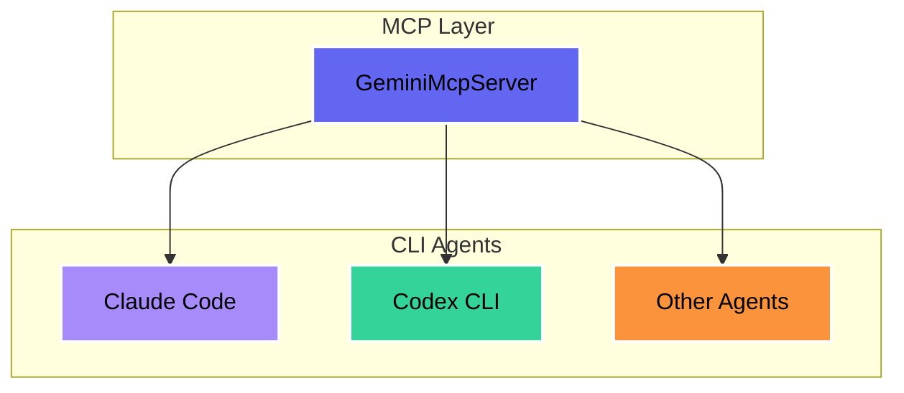
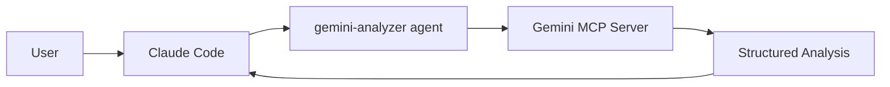

# The Hitchhiker's Guide to AI Coding Agents
## <span style="color: #fbbf24; font-size: 1.3em;">(Don't Panic!)</span>

<div style="color: #e0f2fe; font-size: 1.1em; margin-top: 1.5em;">
Four Ways to Make AI Agents Collaborate<br/>
on Your Codebase
</div>

<div style="color: #c4b5fd; font-size: 0.9em; margin-top: 2em;">
Ken Kousen • AI Codecon • September 2025
</div>

---
layout: default
background: 'linear-gradient(to bottom right, #1e293b, #334155)'
---

## <span style="color: #60a5fa;">The Problem</span>

<div style="font-size: 1.2em; line-height: 2;">

Each AI agent has unique strengths:

- **<span style="color: #60a5fa;">Gemini:</span>** 2M+ token context window
- **<span style="color: #a78bfa;">Claude:</span>** Superior reasoning & code generation
- **<span style="color: #34d399;">GPT-5:</span>** Speed modes & broad capabilities

<div style="margin-top: 1em; padding: 1em; background: rgba(251,191,36,0.1); border-radius: 8px; border: 2px solid #fbbf24;">
<span style="color: #fbbf24;">The Challenge:</span> How do we combine their strengths?
</div>

</div>

---
background: 'linear-gradient(135deg, #065f46, #047857)'
---

## <span style="color: #86efac;">Four Collaboration Patterns</span>

<div style="font-size: 1.15em; line-height: 2.2;">

1. **<span style="color: #fbbf24;">Programmatic Orchestration</span>**  
   <span style="color: #d1fae5;">LangChain4j passing chat memory between agents</span>

2. **<span style="color: #60a5fa;">Manual Multi-Terminal</span>**  
   <span style="color: #d1fae5;">Three console windows, copy-paste coordination</span>

3. **<span style="color: #a78bfa;">MCP Server Wrapping</span>**  
   <span style="color: #d1fae5;">Headless agents exposed as MCP servers</span>

4. **<span style="color: #34d399;">Claude Code Agent Orchestration</span>**  
   <span style="color: #d1fae5;">Sub-agents managed by Claude Code</span>

</div>

---
background: 'linear-gradient(135deg, #1e40af, #1e3a8a)'
---

## <span style="color: #fbbf24;">Method 1: Programmatic (LangChain4j)</span>

**Real Example: OperaGenerator** ([github.com/kousen/OperaGenerator](https://github.com/kousen/OperaGenerator))

```java
@Service
public class OperaGenerator {
    @Autowired ChatLanguageModel claude;
    @Autowired ChatLanguageModel chatGPT;
    @Autowired ChatLanguageModel gemini;
    
    public Opera createOpera(String theme) {
        ChatMemory sharedMemory = new ChatMemory();
        
        // ChatGPT & Claude trade writing scenes
        String scene1 = chatGPT.chat(sharedMemory, 
            "Write opening scene about " + theme);
        String scene2 = claude.chat(sharedMemory, 
            "Continue the opera with next scene...");
        
        // Gemini acts as music critic
        String critique = gemini.chat(sharedMemory, 
            "As a music critic, review this opera...");
        
        return new Opera(scenes, critique);
    }
}
```

<div style="margin-top: 1em; color: #93c5fd;">
✅ Creative collaboration | ✅ Shared context | ✅ Each AI's strengths utilized
</div>

---
background: 'linear-gradient(135deg, #dc2626, #991b1b)'
---

## <span style="color: #fbbf24;">Method 2: Manual Multi-Terminal</span>

**Real Example: Cosmic Catalog** ([github.com/kousen/cosmic-catalog](https://github.com/kousen/cosmic-catalog))

<div style="display: grid; grid-template-columns: 1fr 1fr 1fr; gap: 1rem;">

<div style="background: rgba(96,165,250,0.15); padding: 1em; border-radius: 8px;">
<strong style="color: #60a5fa;">Terminal 1: Gemini</strong>
<pre style="font-size: 0.8em;">
$ gemini "review the code"
> Created tags v6-v7
> Added integration tests
> Version conflict tests
</pre>
</div>

<div style="background: rgba(168,85,247,0.15); padding: 1em; border-radius: 8px;">
<strong style="color: #a78bfa;">Terminal 2: Claude</strong>
<pre style="font-size: 0.8em;">
$ claude code "refactor"
> Created tags v8, v11-v12
> Service extraction
> Caching, exceptions
</pre>
</div>

<div style="background: rgba(52,211,153,0.15); padding: 1em; border-radius: 8px;">
<strong style="color: #34d399;">Terminal 3: Codex</strong>
<pre style="font-size: 0.8em;">
$ codex "add docs"
> Created tags v9-v10
> API documentation
> Docker, CI pipeline
</pre>
</div>

</div>

<div style="margin-top: 1.5em; text-align: center;">
<span style="color: #fbbf24;">Result: v5 → v15 with full production features</span><br/>
<span style="color: #fca5a5;">But: Manual copy-paste between terminals</span>
</div>

---
background: 'linear-gradient(135deg, #312e81, #4c1d95)'
---

## <span style="color: #fbbf24;">Method 3: MCP Server Wrapping</span>

**Real Example: GeminiMcpServer** ([github.com/kousen/GeminiMcpServer](https://github.com/kousen/GeminiMcpServer))

<div style="display: grid; grid-template-columns: 1fr 1fr; gap: 1.5rem;">

<div>

### Setup & Usage

```bash
# Build and connect
$ git clone .../GeminiMcpServer
$ ./gradlew build
$ claude mcp add gemini-analyzer \
  -- java -jar build/libs/*.jar
```

<div style="margin-top: 0.8em; background: rgba(168,85,247,0.1); padding: 0.6em; border-radius: 8px;">
<strong style="color: #a78bfa;">Benefits:</strong>
<span style="font-size: 0.9em;">
✅ 2M+ tokens
✅ Reusable
✅ Token efficient
✅ MCP standard
</span>
</div>

</div>

<div>

### Architecture



<div style="margin-top: 0.5em; color: #e9d5ff; font-size: 0.9em;">
One wrapper, infinite reuse across all your AI agents
</div>

</div>

</div>

---
background: 'linear-gradient(135deg, #4c1d95, #5b21b6)'
---

## <span style="color: #fbbf24;">Method 4: Claude Code Agent Orchestration</span>

<div style="font-size: 1.05em;">

**Real Example from Today:**

```bash
User: "Ask gemini to analyze the codebase"
```

**What Happened:**
1. Claude Code invoked `gemini-analyzer` agent
2. Gemini analyzed 68 files (~78k tokens)
3. Returned comprehensive architecture analysis
4. Saved ~75k tokens in Claude's context

</div>



<div style="margin-top: 1em; color: #c4b5fd;">
✅ Token efficient | ✅ Intelligent routing | ✅ No context switching
</div>

---
background: 'linear-gradient(135deg, #065f46, #047857)'
---

## <span style="color: #fbbf24;">Comparison Matrix</span>

<style>
table { width: 100%; border-collapse: collapse; }
th, td { padding: 0.5em; text-align: center; border: 1px solid rgba(99,102,241,0.3); }
th { background: rgba(99,102,241,0.2); color: #fbbf24; }
.good { color: #86efac; }
.bad { color: #f87171; }
.ok { color: #fbbf24; }
</style>

<table>
<thead>
<tr>
<th>Method</th>
<th>Setup Complexity</th>
<th>Token Efficiency</th>
<th>Automation</th>
<th>Best For</th>
</tr>
</thead>
<tbody>
<tr>
<td><strong>Programmatic</strong></td>
<td class="bad">High</td>
<td class="good">Excellent</td>
<td class="good">Full</td>
<td>Production systems</td>
</tr>
<tr>
<td><strong>Multi-Terminal</strong></td>
<td class="good">None</td>
<td class="bad">Poor</td>
<td class="bad">Manual</td>
<td>Quick experiments</td>
</tr>
<tr>
<td><strong>MCP Wrapping</strong></td>
<td class="ok">Medium</td>
<td class="good">Good</td>
<td class="ok">Semi</td>
<td>Tool sharing</td>
</tr>
<tr>
<td><strong>Agent Orchestration</strong></td>
<td class="good">Low</td>
<td class="good">Excellent</td>
<td class="good">Full</td>
<td>Complex workflows</td>
</tr>
</tbody>
</table>

---
background: 'linear-gradient(135deg, #7c3aed, #6d28d9)'
---

## <span style="color: #fbbf24;">The Cosmic Catalog Demo</span>

<div style="display: grid; grid-template-columns: 1fr 1fr; gap: 2rem; margin-top: 1em;">

<div>

<div style="text-align: center; margin-top: 0.5em; font-size: 0.9em; color: #e9d5ff;">
Featured observations with scoring system
</div>
</div>

<div>

<div style="text-align: center; margin-top: 0.5em; font-size: 0.9em; color: #e9d5ff;">
Professional API documentation (OAS 3.0)
</div>
</div>

</div>

---
background: 'linear-gradient(135deg, #6d28d9, #7c3aed)'
---

## <span style="color: #fbbf24;">The Cosmic Catalog Demo (Details)</span>

<div style="display: grid; grid-template-columns: 1.2fr 1fr; gap: 1.5rem; font-size: 0.95em;">

<div>

### <span style="color: #60a5fa;">What We Built</span>

**Spring Boot app managing telescope observations:**
- 🔭 **Featured Observations**: Veil Nebula, M16 Eagle, GLASS-JWST
- 📊 **Smart Scoring**: Exposure time, filters, instruments
- 🚀 **Real Data**: Hubble (16983, 17100) & JWST (DD-4446, GO-1433)
- ✅ **Approval Workflow**: Version control, optimistic locking

### <span style="color: #a78bfa;">How Agents Contributed</span>

<div style="display: grid; grid-template-columns: 1fr 1fr; gap: 0.5rem; font-size: 0.9em;">
<div>
<strong>Gemini (v6-7):</strong><br/>
• Integration tests<br/>
• Version conflicts<br/>
</div>
<div>
<strong>Claude (v8,v11-12):</strong><br/>
• Service extraction<br/>
• Caching, exceptions<br/>
</div>
<div>
<strong>Codex (v9-10):</strong><br/>
• Swagger API<br/>
• Docker, CI/CD<br/>
</div>
<div>
<strong>All (v13-15):</strong><br/>
• E2E tests<br/>
• Production ready<br/>
</div>
</div>

</div>

<div>

### <span style="color: #34d399;">API Documentation</span>

<div style="background: rgba(52,211,153,0.1); padding: 0.6em; border-radius: 8px;">

**Swagger UI (OAS 3.0):**
```
GET  /health
GET  /api/observations
GET  /api/featured
POST /api/observations/{id}/approve
POST /api/import/sample
POST /api/import/realistic
```

**Production Features:**
- Optimistic locking
- Error responses
- Pagination
- Caching

<strong style="color: #fbbf24;">Time: Hours not weeks!</strong>

</div>

</div>

</div>

---
background: 'linear-gradient(135deg, #1e40af, #1e3a8a)'
---

## <span style="color: #fbbf24;">Key Insights</span>

<div style="font-size: 1.2em; line-height: 2;">

### <span style="color: #60a5fa;">What We Learned:</span>

1. **Token efficiency matters**  
   <span style="color: #e0f2fe;">MCP servers and agents save 90%+ context</span>

2. **Each method has its place**  
   <span style="color: #e0f2fe;">Quick tasks → Multi-terminal | Production → Programmatic</span>

3. **Orchestration is the future**  
   <span style="color: #e0f2fe;">Intelligent routing beats manual coordination</span>

4. **Standards enable innovation**  
   <span style="color: #e0f2fe;">MCP protocol allows tool interoperability</span>

</div>

---
background: 'linear-gradient(135deg, #dc2626, #991b1b)'
---

## <span style="color: #fbbf24;">Practical Recommendations</span>

<div style="font-size: 1.1em;">

### <span style="color: #fde047;">Start Simple, Scale Smart:</span>

<div style="display: grid; grid-template-columns: 1fr 1fr; gap: 1rem; margin-top: 1em;">

<div style="background: rgba(96,165,250,0.1); padding: 1em; border-radius: 8px;">

**For Exploration:**
1. Try multi-terminal first
2. Identify repetitive patterns
3. Wrap frequent tasks in MCP

</div>

<div style="background: rgba(168,85,247,0.1); padding: 1em; border-radius: 8px;">

**For Production:**
1. Start with agent orchestration
2. Add programmatic for CI/CD
3. Use MCP for tool sharing

</div>

</div>

<div style="margin-top: 1.5em; text-align: center; padding: 0.8em; background: rgba(251,191,36,0.1); border-radius: 8px;">
<strong style="color: #fbbf24;">Remember:</strong> The best method is the one that ships code
</div>

</div>

---
background: 'linear-gradient(135deg, #1e40af, #1e3a8a)'
---

## <span style="color: #fbbf24;">🚀 Get Everything</span>

<div style="text-align: center; font-size: 1.05em;">

<div style="margin: 0.5em 0; padding: 1em; background: rgba(251, 191, 36, 0.1); border-radius: 10px; border: 2px solid #fbbf24;">

### <span style="color: #fde047;">Three Repositories, Four Methods</span>

<div style="display: grid; grid-template-columns: 1fr 1fr 1fr; gap: 1rem; margin: 1em 0;">

<div style="background: rgba(96,165,250,0.1); padding: 0.8em; border-radius: 8px;">
<strong style="color: #60a5fa;">Cosmic Catalog</strong><br/>
<span style="font-size: 0.85em; color: #dbeafe;">
github.com/kousen/<br/>cosmic-catalog<br/>
<br/>
📦 Spring Boot app<br/>
🏷️ Git tags v5-v15<br/>
📄 Multi-terminal method
</span>
</div>

<div style="background: rgba(168,85,247,0.1); padding: 0.8em; border-radius: 8px;">
<strong style="color: #a78bfa;">OperaGenerator</strong><br/>
<span style="font-size: 0.85em; color: #e9d5ff;">
github.com/kousen/<br/>OperaGenerator<br/>
<br/>
🎭 LangChain4j demo<br/>
🤖 Programmatic method<br/>
📝 AI collaboration
</span>
</div>

<div style="background: rgba(52,211,153,0.1); padding: 0.8em; border-radius: 8px;">
<strong style="color: #34d399;">GeminiMcpServer</strong><br/>
<span style="font-size: 0.85em; color: #d1fae5;">
github.com/kousen/<br/>GeminiMcpServer<br/>
<br/>
🔌 MCP wrapper<br/>
💎 2M+ token context<br/>
🚀 Agent orchestration
</span>
</div>

</div>

<div style="background: rgba(99,102,241,0.1); padding: 0.6em; border-radius: 8px; margin-top: 0.8em;">
<pre style="color: #c4b5fd; font-size: 0.85em; margin: 0;">git clone https://github.com/kousen/[cosmic-catalog|OperaGenerator|GeminiMcpServer]</pre>
</div>

</div>

</div>

---
background: 'linear-gradient(135deg, #7c3aed, #6d28d9)'
---

## <span style="color: #fbbf24;">Thank You!</span>

<div style="text-align: center;">

### <span style="color: #fde047;">Ken Kousen</span>
<div style="color: #c4b5fd;">President, Kousen IT, Inc.</div>

<div style="display: grid; grid-template-columns: 1fr 1fr; gap: 2em; margin: 2em auto; max-width: 600px;">
<div style="text-align: left; color: #e0f2fe;">
📧 <a href="mailto:ken.kousen@kousenit.com" style="color: #60a5fa;">ken.kousen@kousenit.com</a><br/>
🐙 <a href="https://github.com/kousen" style="color: #60a5fa;">github.com/kousen</a><br/>
📺 <a href="https://youtube.com/@talesfromthejarside" style="color: #60a5fa;">@talesfromthejarside</a>
</div>
<div style="text-align: left; color: #e0f2fe;">
📝 <a href="https://kousenit.substack.com" style="color: #60a5fa;">kousenit.substack.com</a><br/>
💼 <a href="https://linkedin.com/in/kenkousen" style="color: #60a5fa;">linkedin.com/in/kenkousen</a><br/>
🦋 <a href="https://bsky.app/profile/kousenit.com" style="color: #60a5fa;">bsky.app/profile/kousenit.com</a>
</div>
</div>

<div style="margin-top: 2em; padding: 1em; background: rgba(251, 191, 36, 0.1); border-radius: 10px; border: 2px solid #fbbf24;">
<span style="color: #fef3c7;">
AI agents aren't here to replace developers—<br/>
they're here to make us <strong>better</strong> developers.
</span>
</div>

</div>