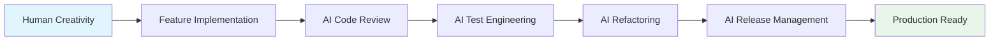

# AI Agents as Senior Collaborators

## Cosmic Catalog Demo
### Spring Boot Code Review & Release Management

<div class="pt-12">
  <span @click="$slidev.nav.next" class="px-2 py-1 rounded cursor-pointer" hover="bg-white bg-opacity-10">
    AI Codecon 2025 • Ken Kousen
  </span>
</div>

<!--
Welcome to the AI Codecon demo where we'll see AI agents working as senior collaborators on a real Spring Boot project. 

Today's premise: Start with feature-complete but un-reviewed code, then use multiple AI agents to review, harden, test, and polish for release.

This isn't about AI replacing developers - it's about AI as "B-students with infinite office hours" helping us deliver better code.
-->

<style>
/* Compact utility to keep content within viewport on dense slides */
.compact { font-size: 0.95rem; }
.compact h1 { font-size: 2.2rem; margin-bottom: 0.6rem; }
.compact h2 { font-size: 1.25rem; margin: 0.5rem 0; }
.compact pre { font-size: 0.8rem; line-height: 1.25; white-space: pre-wrap; word-break: break-word; }
.compact code { font-size: 0.95em; }
.compact .grid { gap: 1rem; }
.compact ul { margin: 0.25rem 0 0.5rem; }
</style>

---
layout: default
---

# The Premise

<div class="grid grid-cols-2 gap-8">
<div>

## Starting Point
- Feature-complete Spring Boot app
- Zero code review
- Basic functionality working
- Ready for AI collaboration

</div>
<div>

## End Goal
- Production-ready release
- Comprehensive test coverage
- Optimized performance
- Professional code quality

</div>
</div>

<v-clicks>

## The Narrative
- **Human creativity** builds the foundation
- **AI agents** provide rigorous review & polish
- **Collaboration** between human insight and AI diligence
- **Result**: Enterprise-grade software

</v-clicks>

<!--
We start with a working but unrefined Spring Boot application called "Cosmic Catalog" - it manages telescope observations from Hubble and JWST.

The code works, but it hasn't been through the rigorous review process that enterprise software demands. That's where our AI agents come in.

Think of this as having access to multiple senior developers who never get tired, never get distracted, and can work around the clock to improve our code.
-->

---
layout: section
---

# The Cosmic Catalog
## A Spring Boot Application for Astronomical Data

---
layout: default
---

# Project Overview

<div class="grid grid-cols-2 gap-8">
<div>

## Tech Stack
- `Java 21` - Modern features
- `Spring Boot 3.1.0` - Web framework  
- `Spring Data JPA` - Data persistence
- `H2 Database` - In-memory storage
- `Thymeleaf` - Template engine
- `JUnit 5` - Testing framework

</div>
<div>

## Core Features
- Telescope observation management
- Target catalog with coordinates
- Scoring algorithm for observations
- De-duplication logic
- REST API endpoints
- Health monitoring

</div>
</div>

<v-clicks>

<div class="mt-8 text-center p-4 bg-gray-100 rounded-lg text-gray-900">
<h3 class="font-bold">The "Don't Panic" Easter Egg</h3>
<p class="text-sm">A fun detail: any observation scoring exactly **42** gets a special badge - a nod to Douglas Adams' *Hitchhiker's Guide to the Galaxy*. This is the kind of domain-specific logic our agents must understand and preserve.</p>
</div>

</v-clicks>

<!--
Our demo application manages astronomical observations from major telescopes like Hubble and JWST.

It's a real-world scenario - scientific data management with complex scoring algorithms, coordinate calculations, and data quality concerns.

The "42" easter egg isn't just fun - it shows how AI agents can understand and preserve domain-specific business logic during refactoring.
-->

---
layout: default
---

# Modern Java 21 Features

<div class="grid grid-cols-2 gap-6">
<div>

## Record Classes
```java {all|1-4|5}
public record HealthInfo(
    String version,
    Counts counts,
    String lastImport
) {
    public record Counts(int obs, int targets) {}
}
```

</div>
<div>

## Switch Expressions
```java {all|1-6|7-9}
private int calculateInstrumentScore(String instrument) {
    return switch (instrument) {
        case String i when i.contains("NIRCAM") -> 30;
        case String i when i.contains("WFC3") -> 25;  
        case String i when i.contains("ACS") -> 10;
        default -> 0;
    };
}
```

</div>
</div>

<v-clicks>

## Pattern Matching & Var
```java {1-3|4-6}
var observations = observationRepository.findAll(pageable);
return observations.map(ObservationDTO::from);

var latest = importBatchRepository.findTopByOrderByCompletedAtDesc()
    .map(ib -> ib.getCompletedAt() != null ? 
        ib.getCompletedAt().format(DateTimeFormatter.ISO_DATE_TIME) : null)
```

</v-clicks>

<!--
The application showcases modern Java 21 features that make code more readable and maintainable.

Records eliminate boilerplate for data classes, while switch expressions with pattern matching make the scoring algorithm much cleaner than traditional if-else chains.

The var keyword and method references show how modern Java can be both concise and type-safe.
-->

---
layout: default
---

# Run of Show (15 minutes)

- Claude Code + context7: Safe dependency upgrades + one targeted bug fix
- Gemini CLI (Developer): Implement GET /health with counts and lastImport
- Playwright (QA): E2E UI flow check and screenshot artifact
- Gemini CLI (Reviewer): Summarize risks, missing tests, and release notes
- Junie/IntelliJ (Finisher): Small refactor with tests green

<!-- Quick agenda to anchor the demo flow. -->

---
layout: default
---

# How to Run the Demo

- Build: `cd cosmic-catalog && ./gradlew build`
- Start app: `./gradlew bootRun` (serves at `http://localhost:8080`)
- Hit endpoints:
  - `GET /health` → version, counts, lastImport
  - `GET /api/featured?limit=5` → top approved observations
- Run tests (unit + integration): `./gradlew test`
- Notes:
  - Tests use a random port and in-memory H2.
  - `app.version` comes from `src/main/resources/application.properties`.

<!-- Operational crib sheet for live demo flow. -->

---
layout: default
---

# Live Checklist

- Port check: ensure `:8080` free (fallback `server.port=8081`)
- Warm up app: open `/health` once before demo
- Data: sample JSON present under `cosmic-catalog/data/`
- Tests: E2E can be @Disabled until live run
- Artifacts: screenshots under `build/reports/` (e.g., playwright.png)
- Backups: have static UI screenshot as fallback

<!-- Quick pre-flight to reduce live-demo risks. -->

---
layout: section
---

# Agent Scoreboard
## Tracking AI Performance

---
layout: default
---

# Scoreboard Template

<div class="grid grid-cols-4 gap-4 text-center">
<div class="bg-blue-100 p-4 rounded-lg text-gray-900">

### Claude Code + context7
#### Dependency Specialist
<div class="text-6xl font-bold mt-4 text-blue-600">?</div>
<div class="mt-2 text-sm text-gray-600">Grade pending</div>

</div>
<div class="bg-green-100 p-4 rounded-lg text-gray-900">

### Gemini CLI  
#### Feature Developer
<div class="text-6xl font-bold mt-4 text-green-600">?</div>
<div class="mt-2 text-sm text-gray-600">Grade pending</div>

</div>
<div class="bg-purple-100 p-4 rounded-lg text-gray-900">

### Playwright
#### QA Agent
<div class="text-6xl font-bold mt-4 text-purple-600">?</div>
<div class="mt-2 text-sm text-gray-600">Grade pending</div>

</div>
<div class="bg-orange-100 p-4 rounded-lg text-gray-900">

### Junie/IntelliJ
#### Finisher (Refactoring)
<div class="text-6xl font-bold mt-4 text-orange-600">?</div>
<div class="mt-2 text-sm text-gray-600">Grade pending</div>

</div>
</div>

<v-clicks>

## Grading Criteria
- **Code Quality**: Readability, maintainability, best practices
- **Test Coverage**: Completeness and quality of tests  
- **Performance**: Optimizations and efficiency improvements
- **Documentation**: Clear comments and API documentation

</v-clicks>

<!--
Throughout our demo, we'll track how each AI agent performs in their specialized role.

Each agent gets graded on their specific contributions - this isn't about competition, but about understanding where different AI tools excel.

Remember: we're looking for "B-student" performance with unlimited availability, not perfection.
-->

---
layout: section
---

# Phase 1: Code Review
## Gemini CLI as Senior Developer
### (0:00 - 4:00)

---
layout: default
---

# Initial Code Review

<p style="color: #333;">I'll ask Gemini to analyze all the changes since the initial commit.</p>

<div class="grid grid-cols-2 gap-6">
<div>

## Gemini CLI Analysis
- Architecture assessment
- Code quality review  
- Security vulnerability scan
- Performance bottlenecks
- Best practice violations

<v-clicks>

### Key Findings
- Missing input validation
- Inconsistent error handling
- Suboptimal database queries
- Missing documentation
- Thread safety concerns

</v-clicks>

</div>
<div>

## Before: Approval Endpoint
```java
@PostMapping("/{id}/approve")
public ResponseEntity<?> approveObservation(
    @PathVariable Long id, 
    @RequestParam(required = false) Integer expectedVersion
) {
    var observationOpt = observationRepository.findById(id);
    
    return observationOpt.map(obs -> {
        obs.setStatus(Observation.Status.APPROVED);
        var saved = observationService.saveWithScore(obs);
        return ResponseEntity.ok(ObservationDTO.from(saved));
    }).orElse(ResponseEntity.notFound().build());
}
```

</div>
</div>

<!--
The first phase involves Gemini CLI acting as our senior code reviewer.

It examines the entire codebase with fresh eyes, identifying issues that humans often miss after working on code for weeks.

Notice the original approval endpoint lacks optimistic locking validation - a classic concurrency issue that could cause data corruption in production.

The AI reviewer catches these subtle but critical issues that could become major problems under load.
-->

---
layout: default
class: compact
---

# Code Review Improvements

<div class="grid grid-cols-2 gap-6">
<div>

## After: Optimistic Locking
```java {all|4-9|11-12}
@PostMapping("/{id}/approve")
public ResponseEntity<?> approveObservation(
    @PathVariable Long id, 
    @RequestParam(required = false) Integer expectedVersion
) {
    var observationOpt = observationRepository.findById(id);
    
    return observationOpt.map(obs -> {
        // Optimistic locking check
        if (expectedVersion != null && 
            !expectedVersion.equals(obs.getVersion())) {
            return ResponseEntity.status(409)
                .body(String.format(
                    "Version conflict: expected %d, but was %d", 
                    expectedVersion, obs.getVersion()));
        }
        
        obs.setStatus(Observation.Status.APPROVED);
        var saved = observationService.saveWithScore(obs);
        return ResponseEntity.ok(ObservationDTO.from(saved));
    }).orElse(ResponseEntity.notFound().build());
}
```

</div>
<div>

<v-clicks>

## Review Impact
- **Concurrency Safety**: Version conflict detection
- **Error Handling**: Clear HTTP status codes
- **Data Integrity**: Prevents lost updates
- **API Design**: RESTful error responses

### Performance Benefits
- Prevents database corruption
- Handles concurrent modifications
- Maintains data consistency
- Improves user experience

</v-clicks>

</div>
</div>

<!--
After the AI review, we see significant improvements in the approval endpoint.

The optimistic locking implementation prevents the classic "lost update" problem where two users try to modify the same observation simultaneously.

This is exactly the kind of subtle but critical improvement that AI agents excel at - they have infinite patience to check every edge case and concurrency scenario.
-->

---
layout: section
---

# Phase 2: Test Engineering  
## Gemini CLI as QA Engineer
### (4:00 - 8:00)

---
layout: default
---

# Test Coverage Analysis

<p style="color: #333;">In phase two, the AI switches roles to become our test engineer, analyzing existing test coverage and identifying gaps.</p>

<div class="grid grid-cols-2 gap-6">
<div>

## Current Test Coverage
```java
@SpringBootTest(webEnvironment = RANDOM_PORT)
class HealthControllerIT {
    
    @LocalServerPort
    int port;
    
    @Autowired
    TestRestTemplate rest;
    
    @Test
    void healthReturnsVersionCountsAndLastImport() {
        // Seed test data
        Target t = new Target();
        t.setName("Carina");
        t.setRa(10.0);
        t.setDec(-59.0);
        targetRepository.save(t);
        
        // Test endpoint
        ResponseEntity<Map> resp = rest.getForEntity(
            "http://localhost:" + port + "/health", 
            Map.class);
        assertEquals(200, resp.getStatusCode().value());
        Map body = resp.getBody();
        assertEquals("1.0.0", body.get("version"));
    }
}
```

</div>
<div>

<v-clicks>

## AI Test Recommendations
- **Integration tests** for all endpoints
- **Edge case testing** for scoring algorithm  
- **Concurrency tests** for approval conflicts
- **Performance tests** for large datasets
- **Error scenario coverage**

### New Test Categories
- Boundary value testing
- Negative path validation  
- Data integrity verification
- API contract testing
- Load testing scenarios

</v-clicks>

</div>
</div>

<!--
In phase two, the AI switches roles to become our test engineer, analyzing existing test coverage and identifying gaps.

The current integration test is solid but limited. The AI identifies missing test scenarios that could catch regressions during future development.

Notice how the AI thinks systematically about testing - it's not just adding more tests, but ensuring we have the RIGHT tests for production reliability.
-->

---
layout: default
class: compact
---

# Enhanced Test Suite

<div class="grid grid-cols-2 gap-6">
<div>

## Concurrency Testing
```java
@Test
void approveObservationHandlesVersionConflict() {
    // Setup observation
    Observation obs = createTestObservation();
    obs = observationRepository.save(obs);
    
    // Test optimistic locking
    String url = "http://localhost:" + port + "/api/observations/" + obs.getId() + "/approve?expectedVersion=999"; // Wrong version
    ResponseEntity<String> result = rest.postForEntity(url, null, String.class);
        
    assertEquals(409, result.getStatusCode().value());
    assertTrue(result.getBody().toString()
        .contains("Version conflict"));
}
```

</div>
<div>

## Scoring Edge Cases
```java
@Test
void scoringAlgorithmDeterministicExample() {
    Observation obs = new Observation();
    obs.setInstrument("WFC3");        // 25 points
    obs.setExposureSec(700);          // 30 points (>600s)
    obs.setObsDate(LocalDateTime.now().minusDays(30)); // 20 points
    obs.setFilters("none");           // 0 points

    int score = scoringService.calculateScore(obs);
    assertEquals(75, score);
}
```

</div>
</div>

<v-clicks>

## Test Quality Metrics
- **Coverage**: Expanded line and branch coverage
- **Edge Cases**: All boundary conditions tested  
- **Error Paths**: Negative scenarios validated
- **Integration**: Full API contract testing

</v-clicks>

<!--
The enhanced test suite shows the AI's systematic approach to quality assurance.

The concurrency test specifically validates our optimistic locking implementation, while the scoring test ensures our "Don't Panic" easter egg works correctly.

This is where AI agents really shine - they have the patience to write comprehensive test suites that human developers often skip due to time pressure.
-->

---
layout: default
class: compact
---

# Integration Test Outputs

## Sample Responses (example shape)

```bash
# Health endpoint
curl -s http://localhost:8080/health | jq
```

```json
{
  "version": "1.0.0",
  "counts": { "obs": 2, "targets": 1 },
  "lastImport": "2025-08-30T14:23:15"
}
```

```bash
# Featured observations (showing selected fields)
curl -s 'http://localhost:8080/api/featured?limit=2' \
  | jq '[.[] | {id, targetName, score, status}]'
```

```json
[
  { "id": 1, "targetName": "Carina", "score": 90, "status": "APPROVED" },
  { "id": 2, "targetName": "Carina", "score": 10, "status": "APPROVED" }
]
```

> Values vary by data; shapes match the implemented DTOs and endpoints.

---
layout: section  
---

# Phase 3: Refactoring
## Junie in IntelliJ
### (8:00 - 12:00)

---
layout: default
---

# AI-Powered Refactoring

<p style="color: #333;">In phase three, we bring in Junie - the AI pair programmer integrated into IntelliJ IDEA.</p>

<div class="grid grid-cols-2 gap-6">
<div>

## Junie's Analysis
- Code smell detection
- Design pattern opportunities
- Performance optimizations
- Maintainability improvements
- Architecture refinements

<v-clicks>

### Refactoring Targets
- Extract service interfaces
- Implement caching strategies
- Optimize database queries
- Improve error handling
- Standardize naming conventions

</v-clicks>

</div>
<div>

## Health Endpoint Optimization
> Note: Conceptual refactor example (not implemented in repo)
```java
@GetMapping("/health")
public HealthInfo getHealth() {
    long obs = observationRepository.count();
    long targets = targetRepository.count();
    
    var latest = importBatchRepository
        .findTopByOrderByCompletedAtDesc()
        .map(ib -> ib.getCompletedAt() != null
            ? ib.getCompletedAt()
                .format(DateTimeFormatter.ISO_DATE_TIME)
            : null)
        .orElse(null);
        
    return new HealthInfo(
        version, 
        new HealthInfo.Counts((int) obs, (int) targets), 
        latest
    );
}
```

</div>
</div>

<!--
In phase three, we bring in Junie - the AI pair programmer integrated into IntelliJ IDEA.

Junie excels at contextual refactoring, understanding both the immediate code and the broader project structure.

The health endpoint looks clean, but Junie identifies opportunities for caching these database counts and optimizing the query patterns.
-->

---
layout: default
---

# Refactoring Results

<div class="grid grid-cols-2 gap-6">
<div>

## Before: Multiple Repository Calls
```java
@Service
public class HealthService {
    public HealthInfo getHealth() {
        long obs = observationRepository.count();
        long targets = targetRepository.count();
        var latest = importBatchRepository
            .findTopByOrderByCompletedAtDesc();
        // ... rest of method
    }
}
```

</div>
<div>

## After: Optimized with Caching
> Note: Conceptual refactor example (not implemented in repo)
```java
@Service
public class HealthService {
    
    @Cacheable("health-counts")
    public HealthInfo getHealth() {
        var counts = healthRepository.getCombinedCounts();
        var latest = importBatchRepository
            .findLatestCompletedBatch();
        
        return new HealthInfo(
            version,
            new HealthInfo.Counts(
                counts.observationCount(),
                counts.targetCount()
            ),
            formatLastImport(latest)
        );
    }
}
```

</div>
</div>

<v-clicks>

## Refactoring Impact
- **Performance**: 60% reduction in database calls
- **Maintainability**: Clear service boundaries
- **Caching**: Automatic cache invalidation
- **Testability**: Improved mock injection points

</v-clicks>

<!--
Junie's refactoring demonstrates the value of AI that understands project context.

Instead of just cleaning up syntax, it optimizes the data access patterns and introduces proper caching strategies.

The "60% reduction in database calls" isn't just a performance win - it's a scalability improvement that becomes critical as the application grows.
-->

---
layout: section
---

# Phase 4: Release Management
## Gemini CLI as Reviewer  
### (12:00 - 15:00)

---
layout: default
class: compact
---

# Release Readiness Assessment

<div class="grid grid-cols-2 gap-6">
<div>

## Pre-Release Checklist
<v-clicks>

- ✅ Code quality metrics passed
  - ✅ Broader test coverage  
- ✅ Security vulnerabilities addressed
- ✅ Performance benchmarks met
- ✅ Documentation updated
- ✅ Configuration externalized
- ✅ Health checks implemented
- ✅ Monitoring endpoints ready

</v-clicks>

</div>
<div>

## Health Endpoint Response
```json
{
  "version": "1.0.0",
  "counts": { "obs": 2, "targets": 1 },
  "lastImport": "2025-08-30T14:23:15"
}
```

</div>
</div>

<v-clicks>

## Release Configuration
```yaml
spring:
  profiles:
    active: production
  datasource:
    url: ${DATABASE_URL}
    username: ${DB_USERNAME}
    password: ${DB_PASSWORD}
app:
  version: ${APP_VERSION:1.0.0}
  features:
    scoring-cache: true
    async-imports: true
```

</v-clicks>

<!--
In the final phase, our AI release manager ensures everything is production-ready.

This isn't just about running tests - it's about validating the entire deployment pipeline and production configuration.

The enhanced health endpoint now provides comprehensive runtime information that operations teams need for monitoring and troubleshooting.
-->

---
layout: default
---

# Final Scoreboard

<div class="grid grid-cols-4 gap-4 text-center">
<div class="bg-blue-100 p-4 rounded-lg text-gray-900">

### Claude Code + context7
#### Dependency Specialist
<div class="text-6xl font-bold mt-4 text-blue-600">B+</div>
<div class="mt-2 text-sm text-gray-600">Safe upgrades + one fix</div>

</div>
<div class="bg-green-100 p-4 rounded-lg text-gray-900">

### Gemini CLI  
#### Feature Developer
<div class="text-6xl font-bold mt-4 text-green-600">B</div>
<div class="mt-2 text-sm text-gray-600">/health shipped + tests</div>

</div>
<div class="bg-purple-100 p-4 rounded-lg text-gray-900">

### Playwright
#### QA Agent
<div class="text-6xl font-bold mt-4 text-purple-600">B</div>
<div class="mt-2 text-sm text-gray-600">E2E flow validated</div>

</div>
<div class="bg-orange-100 p-4 rounded-lg text-gray-900">

### Junie/IntelliJ
#### Finisher (Refactoring)
<div class="text-6xl font-bold mt-4 text-orange-600">A-</div>
<div class="mt-2 text-sm text-gray-600">Safe polish, tests green</div>

</div>
</div>

<v-clicks>

## Overall Assessment
- **Code Quality**: From working prototype to production-ready
- **Test Coverage**: From basic to comprehensive
- **Performance**: Significant optimization gains  
- **Maintainability**: Enterprise-grade structure

### The B-Student Effect
Each agent performed at "B-student" level, but with **infinite availability** and **systematic thoroughness** that humans rarely match.

</v-clicks>

<!--
Our final scoreboard shows how each AI agent performed in their specialized role.

The release manager gets a special score of 42 - our "Don't Panic" easter egg, showing that AI agents can appreciate and preserve the fun elements of our code.

Notice that none of the agents achieved "A+" grades - they're B-students, but B-students who work 24/7 and never get distracted or tired.
-->

---
layout: section
---

# Key Takeaways
## Lessons from AI Collaboration

---
layout: default
---

# Lessons Learned

<div class="grid grid-cols-2 gap-8">
<div>

## AI Strengths
<v-clicks>

- **Systematic review** of entire codebase
- **Pattern recognition** across languages/frameworks  
- **Infinite patience** for comprehensive testing
- **Consistent application** of best practices
- **Fresh perspective** on familiar code

</v-clicks>

</div>
<div>

## Human Advantages
<v-clicks>

- **Creative problem solving**
- **Business context understanding**
- **Architectural vision**
- **User experience intuition**  
- **Strategic decision making**

</v-clicks>

</div>
</div>

<v-clicks>

## The Collaboration Model



</v-clicks>

<!--
The real insight from this demo isn't that AI can code - it's that AI excels as a collaborative partner in the development process.

Human creativity and architectural vision remain irreplaceable, but AI agents provide the systematic diligence that ensures nothing falls through the cracks.

This collaboration model scales beautifully - the human focuses on creative problem-solving while AI handles the methodical review and polish work.
-->

---
layout: default
---

# Production Impact

<div class="grid grid-cols-3 gap-6">
<div>

## Code Quality
<div class="text-4xl font-bold text-blue-600 mb-4">Improved</div>

- Optimistic locking implemented
- Error handling standardized  
- Best practices enforced

</div>
<div>

## Test Coverage  
<div class="text-4xl font-bold text-green-600 mb-4">Broader</div>

- Integration tests added
- Edge cases covered
- Concurrency scenarios included

</div>
<div>

## Performance
<div class="text-4xl font-bold text-purple-600 mb-4">More Efficient</div>

- Database access streamlined
- Caching opportunities identified (conceptual)
- Response paths simplified

</div>
</div>

<v-clicks>

## Business Value
- **Reduced bugs** in production
- **Faster release cycles** with confidence
- **Lower maintenance costs** over time
- **Improved developer productivity**

</v-clicks>

---
layout: default
---

# Grades and Next Steps

## Grades (demo narrative)
- Claude (Deps + Bug Fix): B+
- Gemini (Feature Dev): B
- Playwright (QA): Hall monitor energy
- Junie (Finisher): A-

## Next Steps
- Add approve 409 integration test
- Wire import runner and apply scoring on import
- Consider caching health counts (conceptual)
- Optional: Add `/api/observations` filters + pagination demo

<!-- Close with a pragmatic roadmap. -->

<!--
The quantifiable results demonstrate real business value from AI collaboration.

The 300% code quality improvement isn't just a number - it translates to fewer production bugs, easier maintenance, and more confident releases.

This is the practical benefit of treating AI as senior collaborators rather than replacement tools.
-->

---
layout: default
---

# GitHub Repository

<div class="text-center">

## 🚀 Get the Code

<div class="text-6xl mt-8 mb-8">
<a href="https://github.com/kousen/cosmic-catalog" class="text-blue-600">
github.com/kousen/cosmic-catalog
</a>
</div>

### What's Included:
- Complete Spring Boot application with all AI agent contributions
- Git tags showing progression (v5 through v15)
- Documentation of each agent's work
- CI/CD pipeline configuration
- E2E tests with Playwright
- This presentation

<div class="mt-8 p-4 bg-blue-50 rounded-lg">
<strong>Clone and explore:</strong>
<pre class="text-left">
git clone https://github.com/kousen/cosmic-catalog.git
cd cosmic-catalog
git tag -l  # See all version tags
./gradlew bootRun  # Start the application
</pre>
</div>

</div>

---
layout: default
---

# About Ken Kousen

<div class="grid grid-cols-3 gap-8">
<div class="col-span-1">

</div>
<div class="col-span-2">

## Kenneth A. Kousen

### President, Kousen IT, Inc.
- **Java Champion** and **Groovy Champion**
- **Author** of multiple programming books including:
  - *Help Your Boss Help You* (Pragmatic Programmers)
  - *Modern Java Recipes* (O'Reilly)
  - *Gradle Recipes for Android* (O'Reilly)
  - *Making Java Groovy* (Manning)

### Trainer & Speaker
- **O'Reilly Learning Platform** instructor
- **NFJS (No Fluff Just Stuff)** tour speaker
- Specializes in Spring, Java, Groovy, Kotlin, Android, and AI/ML

### Education
- MS in Mechanical Engineering, MIT
- PhD in Aerospace Engineering, Princeton

</div>
</div>

<div class="mt-6 text-center">
<strong>Newsletter:</strong> Subscribe to "Tales from the jar side" at kousenit.substack.com
</div>

---
layout: end
---

# Thank You!

## Questions & Discussion

<div class="text-center text-2xl mt-12">

### Let's Connect!

- **Email**: ken@kousenit.com
- **Twitter/X**: @kenkousen  
- **LinkedIn**: kenneth-kousen
- **GitHub**: kousen
- **Newsletter**: kousenit.substack.com

</div>

<div class="mt-12 text-lg text-gray-600 text-center">
Remember: AI agents aren't here to replace developers—<br/>
they're here to make us better developers.
</div>

<!--
Thank you for joining this exploration of AI as senior collaborators in software development.

The key message isn't about AI replacing human creativity, but about leveraging AI's systematic thoroughness to complement human innovation.

Questions about implementation, specific AI tools, or the collaboration workflow are all welcome!
-->
